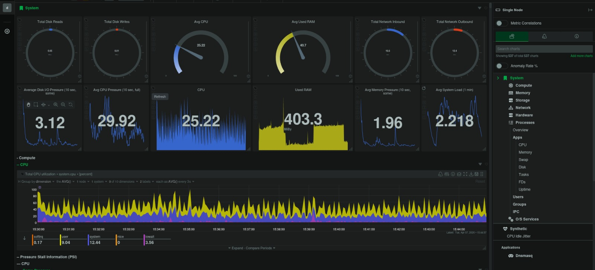
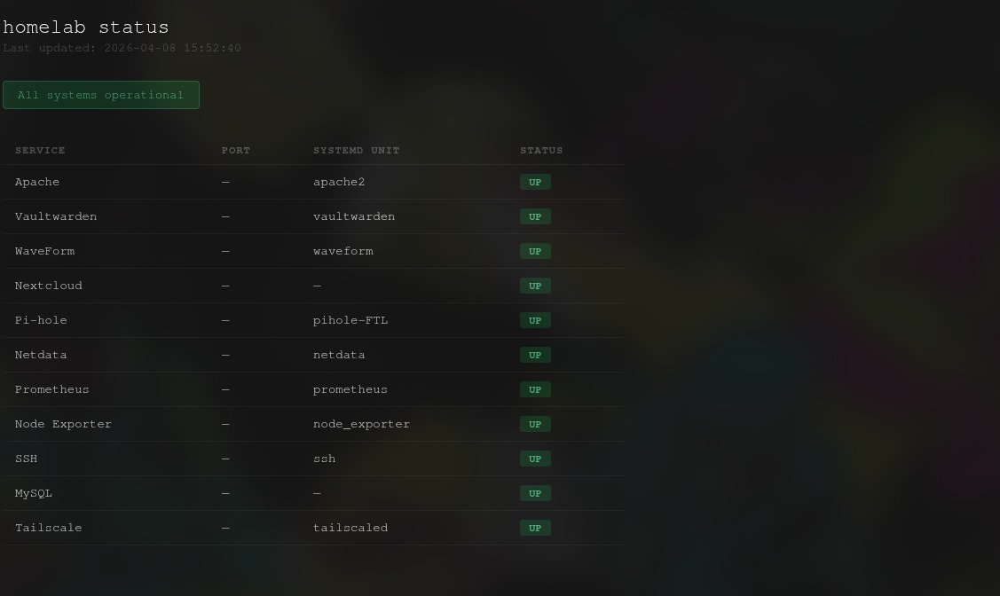

# monitoring-stack

Prometheus + Node Exporter + Netdata running as systemd services on Debian 11 i386, with a self-updating HTML status page for all homelab services.

Docker images for this stack don't ship i386 builds, so everything runs as native binaries.

## Stack

| Component | Purpose | Port |
|-----------|---------|------|
| Node Exporter | System metrics | 9100 |
| Prometheus | Metrics storage | 9090 |
| Netdata | Real-time dashboard | 19999 |
| Status Page | Service health overview | 80 |

## Repository Structure

```
monitoring-stack/
├── prometheus.yml
├── status-page/
│   └── generate_status.py
└── systemd/
    ├── node_exporter.service
    ├── prometheus.service
    ├── status-page.service
    └── status-page.timer
```

## Requirements

- Debian 11 i386
- `wget`, `tar`, `systemd`, `python3`

## Install

### Node Exporter

```bash
wget https://github.com/prometheus/node_exporter/releases/download/v1.7.0/node_exporter-1.7.0.linux-386.tar.gz
tar -xzf node_exporter-1.7.0.linux-386.tar.gz
sudo mv node_exporter-1.7.0.linux-386/node_exporter /usr/local/bin/
sudo useradd --no-create-home --shell /bin/false node_exporter
sudo chown node_exporter:node_exporter /usr/local/bin/node_exporter
sudo cp systemd/node_exporter.service /etc/systemd/system/
sudo systemctl daemon-reload
sudo systemctl enable --now node_exporter
```

### Prometheus

```bash
wget https://github.com/prometheus/prometheus/releases/download/v2.45.0/prometheus-2.45.0.linux-386.tar.gz
tar -xzf prometheus-2.45.0.linux-386.tar.gz
sudo mv prometheus-2.45.0.linux-386/prometheus prometheus-2.45.0.linux-386/promtool /usr/local/bin/
sudo mkdir -p /etc/prometheus /var/lib/prometheus
sudo mv prometheus-2.45.0.linux-386/consoles prometheus-2.45.0.linux-386/console_libraries /etc/prometheus/
sudo cp prometheus.yml /etc/prometheus/
sudo useradd --no-create-home --shell /bin/false prometheus
sudo chown -R prometheus:prometheus /etc/prometheus /var/lib/prometheus
sudo cp systemd/prometheus.service /etc/systemd/system/
sudo systemctl daemon-reload
sudo systemctl enable --now prometheus
```

### Netdata

```bash
wget -O /tmp/netdata-kickstart.sh https://get.netdata.cloud/kickstart.sh
sh /tmp/netdata-kickstart.sh
sudo systemctl enable --now netdata
```

### Status Page

Edit `status-page/generate_status.py` and update the `SERVICES` list to match your setup, then:

```bash
sudo mkdir -p /var/www/html/status
sudo cp status-page/generate_status.py /opt/generate_status.py
sudo cp systemd/status-page.service /etc/systemd/system/
sudo cp systemd/status-page.timer /etc/systemd/system/
sudo systemctl daemon-reload
sudo systemctl enable --now status-page.timer
```

The page regenerates every 60 seconds and is served at `http://<your-server-ip>/status`.

## Verify

```bash
sudo systemctl status node_exporter prometheus netdata status-page.timer
curl http://localhost:9090/api/v1/targets | python3 -m json.tool | grep -E "job|health"
```

## Screenshots



